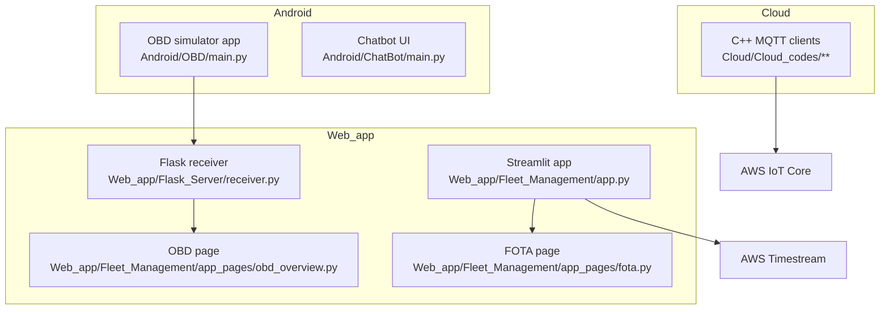

# Secured Vehicle OBD LLM System — Architecture

## Overview

This repository is a monorepo for an end-to-end secured vehicle on-board diagnostics (OBD) and fleet monitoring system. It combines Android (Kivy) apps, AWS IoT MQTT clients implemented in C++, a lightweight Flask ingestion service for uploaded JSON logs, and a Streamlit web dashboard that visualizes fleet telemetry and supports a FOTA workflow.

At a high level, the system moves diagnostic and telemetry data from “vehicle-side” components into the cloud (AWS IoT Core and/or an EC2-hosted upload endpoint), then presents the aggregated results in a web dashboard.

## Repository structure and major subsystems

The repository is organized into four major areas:

### Android apps (`Android/`)

1. `Android/OBD/main.py` is a Kivy-based OBD simulator/diagnostic UI. It generates diagnostic trouble codes, writes a JSON log file, and uploads the JSON file via HTTP to a server endpoint.

2. `Android/ChatBot/main.py` is a Kivy-based chatbot UI that connects to a local TCP backend on `127.0.0.1:5800`. The file also launches a backend thread by importing a backend module. The frontend supports model switching (LLM vs LSTM) and voice/recording control messages.

### Cloud IoT clients (`Cloud/Cloud_codes/`)

The `Cloud/Cloud_codes/**` directory contains several C++ applications (for example `LSM.cpp`, `BootLoader.cpp`, and `Network.cpp`) that connect to AWS IoT Core using MQTT over TLS with mutual authentication (certificate and private key).

These clients read JSON payloads from files referenced by `payload_list.txt`, add a `time` field, and publish messages to specific MQTT topics (for example `lsm_topic`, `BL_topic`, and `network_topic`). They also subscribe to the same topic and log received messages, ignoring messages associated with their own `Car_ID`.

### Web application (`Web_app/`)

1. `Web_app/Flask_Server/receiver.py` implements a Flask server with a single endpoint `POST /upload-json` that accepts an uploaded `.json` file and saves it to a local directory `received_jsons/` under a timestamped filename.

2. `Web_app/Fleet_Management/app.py` is the Streamlit entrypoint. It sets up a sidebar and routes to several pages under `Web_app/Fleet_Management/app_pages/` (for example introduction, OBD overview, LSM overview, SomeIP overview, network overview, FOTA page, and bootloader cloud page).

3. Streamlit pages handle dashboard rendering and, depending on the page, either:
   - query AWS Timestream for “live” data (for example SomeIP/LSM/network pages per their descriptions), or
   - read uploaded JSON files from a server-side directory (for example `obd_overview.py` reads JSONs from `/home/ubuntu/Flask_Server/received_jsons`).

### Bootloader / FOTA assets (`Web_app/Fleet_Management/BootLoader/`)

The Streamlit FOTA page saves uploaded firmware binaries to a `Bootloader/` directory and then executes `Bootloader/cloud.py` via `subprocess.run`. The exact implementation of `cloud.py` is not documented here because it was not read as part of this task, but `fota.py` shows that it is invoked after upload and receives the uploaded file path as an argument.

## Architecture diagrams

### System context diagram

```mermaid
flowchart LR
  AndroidOBD["Android OBD App (Kivy)\nAndroid/OBD/main.py"]
  AndroidChatbot["Android Chatbot App (Kivy)\nAndroid/ChatBot/main.py"]
  LocalBackend["Local Chatbot Backend\n(127.0.0.1:5800)"]
  Flask["Flask JSON Receiver\nWeb_app/Flask_Server/receiver.py"]
  Streamlit["Streamlit Fleet Management UI\nWeb_app/Fleet_Management/app.py"]
  AWSIoT["AWS IoT Core (MQTT)"]
  Timestream["AWS Timestream"]

  AndroidOBD -->|HTTP POST /upload-json\nJSON file upload| Flask
  Flask -->|Stores JSON files on disk| Streamlit

  AndroidChatbot <-->|TCP socket\n127.0.0.1:5800| LocalBackend

  CloudClients["C++ IoT Clients\nCloud/Cloud_codes/**"] -->|MQTT publish/subscribe| AWSIoT
  AWSIoT -->|Ingestion/forwarding (out of repo scope)| Timestream
  Streamlit -->|Queries (page dependent)| Timestream
```

### Container-level view (repository components)



## Key data flows

### 1) OBD fault generation and upload (Android → Flask → Streamlit)

`Android/OBD/main.py` generates diagnostic events and serializes them to JSON.

The JSON upload flow is:

1. The OBD app writes a JSON file to disk via `save_fault_to_log(...)`. The log entry includes fields such as `Car_ID`, `Board`, `Location`, `Error_Code`, and `time` (human-readable timestamp).
2. The app calls `send_json_file_to_ec2()` which uploads that JSON file to `http://13.58.250.233:5000/upload-json` using `requests.post(..., files=...)`.
3. `Web_app/Flask_Server/receiver.py` handles `POST /upload-json`. It validates the presence of a file and the `.json` extension, and saves it to `received_jsons/uploaded_<timestamp>.json`.
4. `Web_app/Fleet_Management/app_pages/obd_overview.py` reads JSON files from a server directory (`/home/ubuntu/Flask_Server/received_jsons`), aggregates records into a pandas DataFrame, and renders them in Streamlit.

This creates a simple “archive + dashboard” pipeline where the filesystem directory on the server is the persistence layer for OBD uploads.

### 2) MQTT telemetry publishing (C++ clients → AWS IoT Core)

C++ clients like `Cloud/Cloud_codes/LSM/LSM.cpp` follow a similar pattern:

1. The client creates an MQTT connection using a certificate (`certificate.pem.crt`), private key (`private.pem.key`), and root CA (`AmazonRootCA1.pem`).
2. The client connects to the AWS IoT Core endpoint `a32s23mkugyl92-ats.iot.us-east-2.amazonaws.com` and uses `CAR_ID` (for example `"101"`) as the client identifier.
3. The client subscribes to its topic (for example `lsm_topic`) and logs incoming messages, ignoring messages whose `Car_ID` matches its own.
4. In a loop, the client reads a line from `payload_list.txt` to obtain the path to a JSON payload file, loads it with nlohmann/json, adds a millisecond epoch timestamp into `payload["time"]`, and publishes to the topic.
5. The loop sleeps for 5 seconds between publishes.

This design allows test payloads to be changed by editing `payload_list.txt` and/or the referenced JSON payload files without recompiling.

### 3) Fleet dashboard queries (Streamlit → AWS Timestream)

The Streamlit application routes to multiple pages. Several pages are described as querying AWS Timestream (for example, SomeIP, LSM, and network overview pages). Although the exact code for the Timestream queries is not included in this document (beyond file identification), the architecture intention is clear: AWS IoT Core is used for ingestion, and AWS Timestream is used as the queryable time-series store for the fleet dashboards.

### 4) FOTA upload and “cloud script” trigger (Streamlit → local script)

`Web_app/Fleet_Management/app_pages/fota.py` implements a firmware upload flow:

1. A user uploads a `.bin` firmware file through Streamlit.
2. The file is written to a local `Bootloader/` directory.
3. Streamlit executes `Bootloader/cloud.py` using `subprocess.run(['python3', cloud_script_path, save_path], ...)`.
4. The page prints stdout/stderr and removes the uploaded `.bin` afterward.

This implies the FOTA delivery mechanism is implemented in `cloud.py` and runs server-side from the Streamlit host. The details of how `cloud.py` publishes/ships firmware (for example via MQTT) are outside the scope of this document because they are not shown in the reviewed sources.

## Deployment shape (typical)

A typical deployment can be inferred from the hard-coded server paths and endpoints:

1. An EC2 instance hosts the Flask receiver service on port 5000 (`receiver.py` runs `host='0.0.0.0', port=5000`).
2. The same machine (or another server) hosts the Streamlit app. The OBD dashboard page expects the JSON archive directory at `/home/ubuntu/Flask_Server/received_jsons`, which implies the Streamlit host has local access to the Flask receiver’s saved files (commonly achieved by co-locating Streamlit and Flask on the same host or mounting/shared storage).
3. AWS IoT Core serves as MQTT broker for the C++ clients.
4. AWS Timestream serves as the time-series database queried by some Streamlit pages.

## Cross-cutting concerns

### Security

Mutual TLS is used for AWS IoT connections in the C++ clients via X.509 certificates and private keys, plus Amazon Root CA. This is consistent with AWS IoT Core best practices for device authentication.

The Flask upload endpoint accepts files with a `.json` filename suffix and saves them. There is no authentication layer in `receiver.py` as written, and the server binds to `0.0.0.0`. If this is deployed to the public internet, it should be protected (for example with security groups/IP allowlists, an API gateway, or auth tokens), and additional validation of uploaded content should be considered.

### Data model conventions

Two different timestamp patterns appear in the code:

- Android OBD logs store a human-readable timestamp string under `time` (for example `"%I:%M %p %d-%m-%y"`).
- MQTT clients store `time` as epoch milliseconds (stringified) via `getCurrentTimestamp()`.

Dashboard pages and downstream storage should normalize timestamps if they are merged into a single dataset.

## Entry points

- Streamlit fleet management dashboard:
  - `Web_app/Fleet_Management/app.py`

- Flask JSON receiver:
  - `Web_app/Flask_Server/receiver.py`

- Android OBD app:
  - `Android/OBD/main.py`

- Android chatbot app:
  - `Android/ChatBot/main.py`

- C++ MQTT clients:
  - `Cloud/Cloud_codes/LSM/LSM.cpp`
  - `Cloud/Cloud_codes/BoatLoader/BootLoader.cpp`
  - `Cloud/Cloud_codes/Network/Network.cpp`
  - (and other topic-specific clients in neighboring directories)

## Notes and limitations of this document

This architecture document is based strictly on files inspected in this task. Some referenced modules exist but were not read (for example `Bootloader/cloud.py`, Streamlit page implementations beyond `fota.py` and `obd_overview.py`, and the chatbot backend module imported as `backend.chat`). If those components are important to your production architecture, they should be added as explicit sections after reviewing their implementations.

Task completed: Added a repository-level ARCHITECTURE.md documenting the system architecture, components, data flows, and deployment shape grounded in the current source code.
